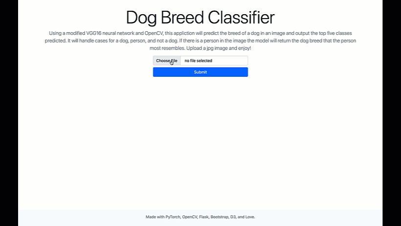

# Beta - Personal Website
Using a midified VGG16 neural network and OpenCV, this Flask application will predict the breed of the dog with a certain probability and output the topk (k=5) results. The application handles cases for a dog, person, and not a dog. Using a haarcascade alogrithm the app will detect if there is a person in the image, then return the dog breed that the person looks most likely resembles. Enjoy!

Stay tuned for more additions to this projects! 
