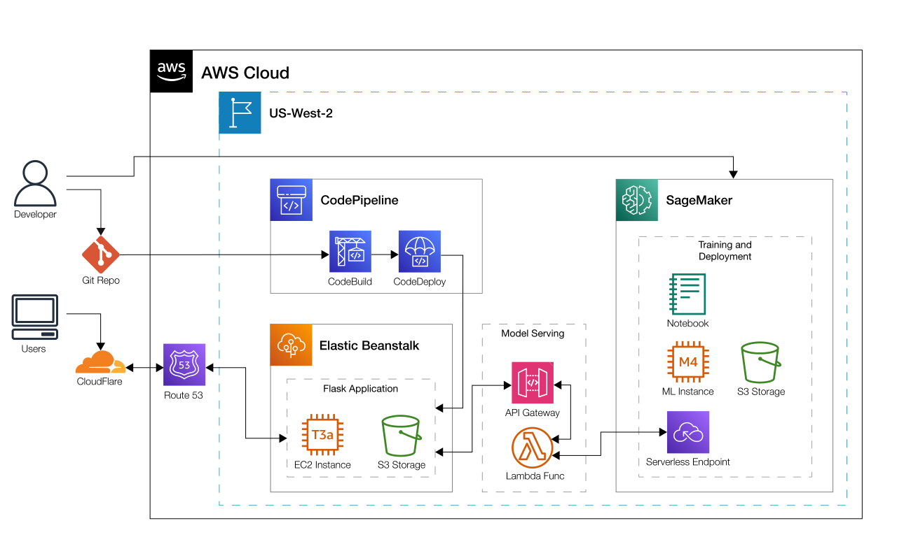

# Personal Website
This website is part portfolio and part web application that allows for user interactivity. 
The front end is built using HTML, Flask, Bootstrap, JQuery, and D3 and is deployed 
on AWS EC2 using Elastic Beanstalk. Git and AWS CodePipeline are integrated for version control 
and continuous deployment. The Machine Learning portions of the site are built using AWS 
Sagemaker, PyTorch, and XGBoost, then deployed to a serverless endpoint. A REST API 
and lambda function work together to serve the predictions from the model to the client. Enjoy!

